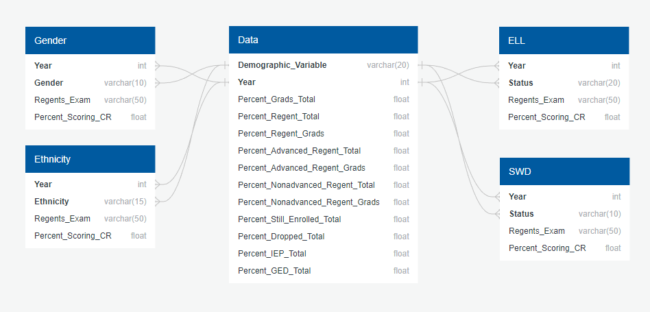

# Final Project - Education Analysis

## Group Name
#### PBJAM

## Selected Topic
Apply machine learning to education data, specifically predict outcomes of student groups.

## Description of Data
From NYC Department of Education, includes demographic data, total and percentages of graduates, students that passed regents or advanced regents exams, currently enrolled, drop outs, alternative diplomas (IEP/GED).
Also from the NYC Department of Education, we got another dataset with student exam scores.
Once the data is cleaned, it should look similar to this DB mock-up:

## Questions to be Answered
- What are the factors that more heavily affect academic performance?
- What are the leading factors that affect highschool graduation rates?
- Can machine learning be used "in reverse", to determine demographics or other factors based on academic performance. 
